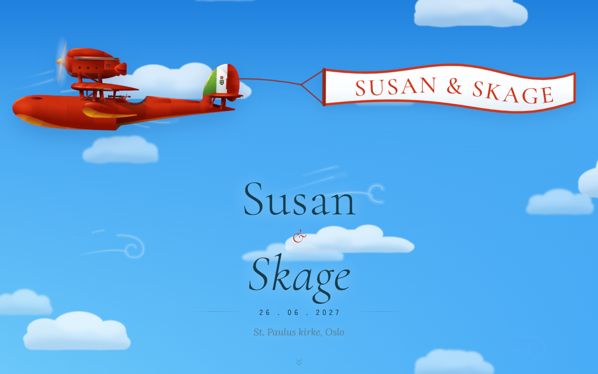
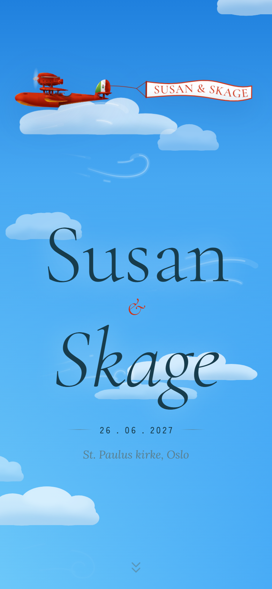

# Susan & Skage

Bryllupsside på én rullende side: et rødt Savoia-sjøfly trekker et håndmalt
banner over toppen, og alt det praktiske ligger lenger nede på boardingkort som
faller forbi kameraet. Norsk tekst, ingen meny, ingen backend.

React 19 + Vite 8, statisk bygg, publisert på GitHub Pages.

|                    Desktop                     |                   Mobil                    |
| :--------------------------------------------: | :----------------------------------------: |
|  |  |

## Kom i gang

```bash
npm install
npm run dev
```

Siden kjører på <http://localhost:5173>.

| Kommando          | Hva den gjør                    |
| ----------------- | ------------------------------- |
| `npm run dev`     | Utviklingsserver med hot reload |
| `npm run build`   | Statisk bygg til `dist/`        |
| `npm run preview` | Serverer `dist/` lokalt         |
| `npm run lint`    | Oxlint                          |

## Innhold

Alt av tekst, datoer, adresser og lenker ligger i
[`src/config.js`](src/config.js). Ingen streng er hardkodet i en komponent.
Feltene merket ⚠️ må erstattes før siden deles.

## Struktur

```
src/
  App.jsx        rekkefølgen på seksjonene
  config.js      alt innhold
  index.css      tokens + reset + basetypografi
  components/    én komponent per seksjon, pluss himmelprimitivene
  lib/           kameraet (parallax), kartvalg, reduced-motion
  styles/        base, sky, hero, sections
```

Siden har to seksjoner, begge et `<Panel>` (et boardingkort): **Hvor & når** og
**Svar**. Hver fil forklarer sine egne valg i toppen.

## Publisering

`.github/workflows/deploy.yml` bygger og publiserer til GitHub Pages ved push
til `main`. Første gang må **Settings → Pages → Source** stå på **GitHub
Actions**.

Siden serveres fra en underkatalog, så `base` i `vite.config.js` må stemme med
repo-navnet. Endrer du navnet, må `base` og `og:image` / `og:url` / `canonical`
i `index.html` oppdateres.

---

Flyet, himmelen og fargene er en hyllest til _Porco Rosso_ © 1992 Studio Ghibli.
